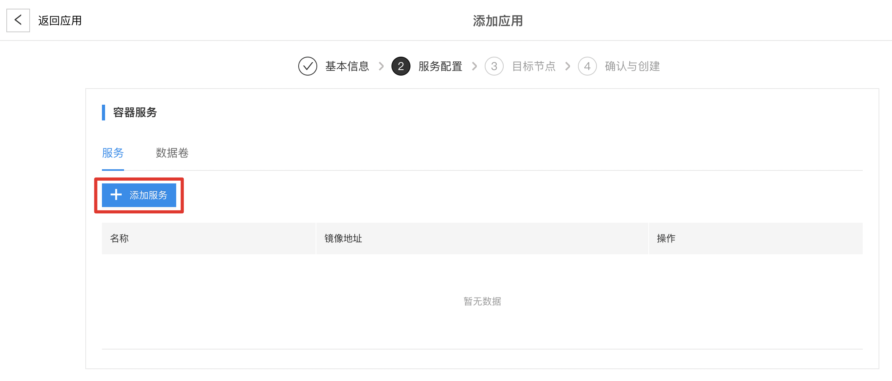
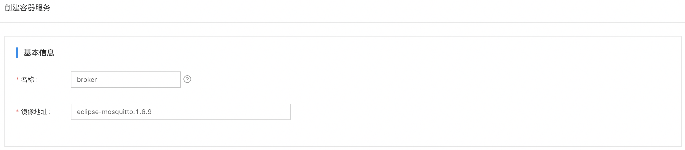

# 应用部署实践

通过云端创建应用并部署至边缘设备上，需要完成 **节点创建，节点安装，应用创建，应用节点匹配** 等操作。其中，节点安装可以在应用创建并匹配节点之前或之后完成。应用与节点匹配则是通过为应用配置和节点标签相同的“匹配标签”实现（需要注意与应用标签并不相同）。通过该方式，一个应用可以匹配到多个节点，一个节点也可以关联多个应用。云端基于“匹配标签”监测目标节点，对于所有满足匹配条件的节点执行应用部署。支持多标签匹配，多标签之间是“与”的关系。
应用分为容器应用和函数应用，以容器应用为例，一个应用包含有服务配置，数据卷，镜像仓库凭证，匹配节点标签等。一个应用可以包含有多个服务，但推荐一个应用仅包含一个服务。一个服务需要对服务的端口，副本数量等进行配置，此外也可能需要对服务所使用的配置文件，相关数据等进行管理。
以在边缘设备部署一个mosquitto broker应用为例，应用中包含有一个broker的服务，服务所使用的配置文件数据卷，匹配应用标签等。

## 创建节点
依次点击 **边缘节点 > 创建节点** 打开创建节点页面，输入节点名，描述信息，添加节点标签  **node=node-1**


点击确定，返回节点列表页查看该节点已创建


## 创建配置

* broker配置

选择菜单栏的配置管理， 在配置项栏点击创建配置项，创建应用所使用的的配置，配置名为 **broker-conf** , 选择添加配置数据，变量名为mosquitto.conf，即服务运行时所加载的配置文件名字，变量值即为配置文件内容。


（变量值）文件内容如下，具体配置项说明可以参考 [mosquitto配置](https://mosquitto.org/man/mosquitto-conf-5.html)，主要配置了mqtt broker开放1883端口，数据存储路径等
```
port 1883
autosave_interval 180
autosave_on_changes true
persistence true
persistence_file mosquitto.db
persistence_location /mosquitto/data/
log_type all
connection_messages true
log_dest file /mosquitto/log/mosquitto.log
allow_anonymous true
```

点击确定返回配置列表查看该配置项已创建


## 创建应用

创建应用包含有4个步骤，第一步基本信息是对添加应用配置名字与标签等基本信息；第二步是对应用所包含的服务模块进行配置，不仅包括服务启动的端口，副本数量等参数，也包括服务所使用的配置文件，镜像仓库凭证等；第三步是对应匹配的标签进行配置（需要注意匹配标签与第一步所配置的标签并不相同），通过配置与期望部署节点相同的匹配标签项，可以将应用与节点进行匹配，从而达到将应用部署到期望边缘设备的目标；第四步是对应用创建进行确认，完成应用的创建。

依次点击 **应用部署 > 创建应用**。在添加应用的第1步基本信息中输入应用名称，描述信息，添加应用标签（可选），然后点击下一步


在第2步模块配置中点击 **添加容器服务**



在创建容器服务页面对应用进行配置，配置服务名称、镜像地址



卷配置中对服务所使用的配置进行配置，关联之前创建的配置 **broker-conf**。点击 **添加卷** 输入卷名称conf, 卷类型选择配置项。配置项选择已创建的 **broker-conf**, 容器目录为/mosquitto/config，这是mosquitto应用启动后加载配置文件的路径，文件名为配置项中的配置名（在这里即为mosquitto.conf）。配置项的读写权限设置为只读类型。


端口配置项点击 **添加端口映射**，宿主机和容器内端口都使用 **1883**


点击确定完成服务配置, 然后点击下一步

在第3步目标设备页点击匹配标签，输入之前创建节点的标签键 **node** 和标签值 **node-1**，点击确定


查看已匹配的节点为之前创建的节点 **node-1**


最后第4步点击创建完成应用创建，在应用列表查看该应用已创建。


## 节点安装

点击左侧菜单栏边缘节点，点击已创建的节点 **node-1**，在节点详情页点击 **安装**，复制在线安装的命令，baetyl运行模式包括 **k3s+docker** 和 **k3s+containerd** 两种，用户根据实际需要选择运行环境安装命令，需要注意的是，若用户选择 **k3s+docker** 运行环境，需先安装 docker 后再安装 k3s。

- 节点安装-containerd


- 节点安装-docker


运行环境准备就绪后，执行节点安装命令，即可安装边缘节点，效果如下：


确认系统应用的服务已经启动并处于Running状态，其中系统应用位于 **baetyl-edge-system** 命名空间下，包括 **baetyl-core** 和 **baetyl-function**，用户应用位于 **baetyl-edge** 命名空间下, 确认之前所创建的broker应用为Running状态，表示应用已正常启动了。


在节点详情页可以查看边缘设备与云端已处于连接转态，设备相关信息也已上报，可以在该页面查看设备硬件信息以及资源使用情况。这里需要手动刷新状态，默认20秒会上报一次状态，无需频繁刷新。


点击左侧菜单栏的应用部署，可以查看应用部署情况以及应用资源使用情况，可以看到系统应用 **baetyl-core**、**baetyl-function** 和 用户应用 **broker** 的部署状态都是已部署，服务状态栏显示了3个应用各自的资源使用情况。


使用mqtt.box客户端连接边缘设备，连接配置中Host填边缘设备的实际IP地址，部署的mqtt broker开放端口为1883，对订阅主题不做限制，订阅test主题后往test主题发消息验证可以接收到消息，即说明 mqtt broker 已正常运行。


**[注意]** 如果是Mac系统的边缘设备，由于Mac系统下宿主机端口映射无法正常工作，所以连接会失败
