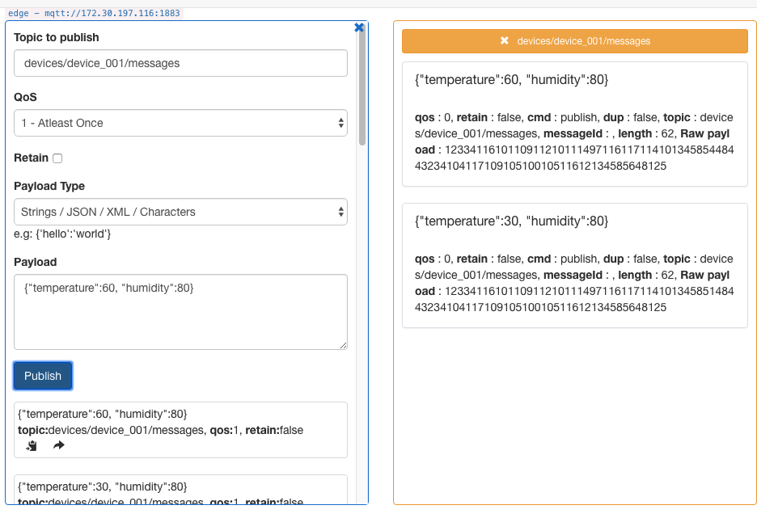

# 基于 Baetyl 集成 Kuiper 流式处理引擎

本文以一个常见的物联网使用场景为案例，介绍了如何利用边缘计算框架 Baetyl 来实现对业务的快速、低成本和有效地处理。

在各类物联网项目中，比如智能楼宇项目，需要将楼宇的数据（比如电梯、燃气、水电等）进行采集和分析。一种解决方案是将所有的设备直接接入在云端的物联网平台，类似于像 Baidu Iot Core 或者 AWS Iot Core。这种解决方案的问题在于，数据处理时延较长：

- 数据处理时延较长：通过 Internet 传输和云端的处理后返回给设备，所需时间较长
- 数据传输和存储成本：通过 Internet 传输需要带宽，对于大规模连接的物联网项目来说，耗费的带宽会相当可观
- 数据的安全性：有些物联网的数据会相当敏感，全部通过物联网传输的话会有风险

为了解决以上的问题，业界提出了边缘计算的方案，边缘计算的核心就在于把数据进行就近处理，避免不必要的时延、成本和安全问题。开源框架 Baetyl 是百度贡献给 Linux 基金会的开源边缘计算框架，主推物联网场景下端侧的边缘计算解决方案。

本文将流处理模块 Kuiper 部署到边缘计算框架 Baetyl 上，对一段时间内边缘侧的设备消息进行流式处理，并将处理结果上传云端进行存储。

## 业务场景

假设现有一组设备，组中的每个设备有一个 id，通过 MQTT 协议往 MQTT 消息服务器上相应的主题发送数据。主题的设计如下，其中 {device_id} 为设备的 id。

```
devices/{device_id}/messages
```

每个设备发送的数据格式为 JSON，发送的通过该传感器采集的温度与湿度数据。

```
{
    "temperature": 30,
    "humidity" : 20
}
```

现在需要实时分析数据，并提出以下的需求：对每个设备的温度数据按照每 10 秒钟计算平均值(t_av)，并且记下 10 秒钟内的最大值 (t_max)、最小值(t_min) 和数据条数(t_count)，计算完毕后将这 4 个结果进行保存，以下为样例结果数据：

```
[
    {
        "device_id" : "1", "t_av" : 25,  "t_max" : 45, "t_min" : 5, "t_count" : 2
    },
    {
        "device_id" : "2", "t_av" : 25,  "t_max" : 45, "t_min" : 5, "t_count" : 2
    },
    ...
]
```

## 方案介绍

如下图所示，我们将在 Baetyl 边缘计算框架上，采用边缘分析/流式数据处理的方式，从 Baetyl-Broker 订阅相关设备消息，最后将处理结果输出到 Baidu 的 Iot Core 中。


- [Baetyl-Broker](https://github.com/baetyl/baetyl-broker) 是 Baetyl 框架端侧的消息中间件，采用 MQTT3.1.1 协议，可在低带宽、不可靠网络中提供可靠的消息传输服务。
- [Kuiper](https://github.com/emqx/kuiper) 是基于 SQL 的轻量级边缘流式数据分析引擎，安装包只有约 7MB，非常适合于运行在边缘设备端
- [Baidu Iot Core](https://cloud.baidu.com/doc/IoTCore/index.html) 提供了比较全的设备接入和数据分析的方案，此处用于云端的结果数据接入，以及应用所需的结果数据分析

## 实现步骤

本文使用 Baetyl 对应的云端管理平台进行演示操作。

### 安装 Baetyl 计算框架

在云端新建边缘节点并安装到边缘设备。安装成功后如下所示：


### 新建 Iot Core 实例

参考 [百度云文档](https://cloud.baidu.com/doc/IoTCore/s/Akck4811r) 在 Iot Core 新建 Iot Core 实例并进行相关的设备模板配置。配置成功后，使用 MqttBox 进行连接，其中 $iot/test-kuiper/user/# 主题是我们自定义的具有收发权限的用户主题。

相应的连接信息类似如下所示：
```
"mqtt":
  "server": "tcp://anwhswx.iot.gz.baidubce.com:1883",
  "topic": "$iot/test-kuiper/user/b",
  "protocol_version": "3.1.1",
  "username": "anwhswx/test-kuiper",
  "password": "xxxxxxxx"
```

我们可以通过 MqttBox 进行连接验证该 Iot Core 实例的连通性。


如上图可以观察到 Iot Core 实例的消息收发正常。

### 安装 Baetyl-Broker

新建容器应用 broker，并添加 baetyl-broker 服务，设置镜像以及端口。Baetyl-Broker 默认会监听 1883 端口，并允许匿名登录。


镜像地址
```
baetyltech/broker:v2.0.0
```

然后通过标签匹配到我们事先创建的节点上。


### 安装 Kuiper

从 Kuiper 官方镜像仓库镜像仓库选取 Kuiper 的官方 Docker 镜像，这里选取的是：

```
emqx/kuiper:0.5.1-alpine
```

然后创建容器服务，并添加 kuiper 服务，设置镜像、添加端口映射以及环境变量 MQTT_BROKER_ADDRESS=baetyl-broker:1883。其中环境变量中的 baetyl-broker 对应于上一步中 Baetyl-Broker 服务名称。


然后通过标签匹配到我们事先创建的节点上。


用户可以通过 telnet 命令来判断边缘设备上 Kuiper 是否启动成功。


更多 Kuiper 资料可以参考 [Kuiper 官网](https://github.com/emqx/kuiper) 。

### 安装 Baetyl 集成 Kuiper 插件

Kuiper 原生的 stream、rule 创建都是通过 Http 请求，为了适配 Baetyl 平台，可以使用 Kuiper 推出的适配插件: [kuiper-kubernetes-tool](https://github.com/emqx/kuiper/tree/master/tools/kubernetes) ，支持从配置文件加载 stream、rule 配置。

从 Kuiper 官方镜像仓库镜像仓库选取 Kuiper 的官方 Docker 镜像，这里选取的是：

```
emqx/kuiper-kubernetes-tool:0.5.1
```

我们在新建 Kuiper 插件应用时，先新建对应的配置文件。

#### 创建流语法解析

创建流的目的是为了定义发送到该流上的数据格式，类似于在关系数据库中定义表的结构。 Kuiper 中所有支持的数据类型，可以参考 [Kuiper 官网](https://github.com/emqx/kuiper) 。

```
{
    "commands":[
        {
            "url":"/streams",
            "description":"create stream1",
            "method":"post",
            "data":{
                "sql":"create stream demo (temperature float, humidity bigint) WITH (FORMAT=\"JSON\", DATASOURCE=\"devices/+/messages\");"
            }
        }
    ]
}
```

上述语句在 Kuiper 中创建了一个名为 demo 的流定义，包含了两个字段，分别为 temperature 和 humidity，数据源为订阅 MQTT 的主题 devices/+/messages，这里请注意采用了通配符 +，用于订阅不同设备的消息。

#### 数据业务逻辑处理语法解析

Kuiper 采用 SQL 实现业务逻辑，每10秒钟统计温度的平均值、最大值、最小值和次数，并根据设备 ID 进行分组，实现的 SQL 如下所示。

```
{
    "commands":[
        {
            "url":"/rules",
            "description":"create rule1",
            "method":"post",
            "data":{
                "id":"rule1",
                "sql": "SELECT avg(temperature) AS t_av, max(temperature) AS t_max, min(temperature) AS t_min, COUNT(*) As t_count, split_value(mqtt(topic), \"/\", 1) AS device_id FROM demo GROUP BY device_id, TUMBLINGWINDOW(ss, 10)",
                "actions": [
                    {
                        "log": {}
                    },
                    {
                        "mqtt": {
                            "server": "tcp://anwhswx.iot.gz.baidubce.com:1883",
                            "topic": "$iot/test-kuiper/user/b",
                            "protocol_version": "3.1.1",
                            "qos": 0,
                            "clientId": "demo_001",
                            "username": "anwhswx/test-kuiper",
                            "password": "xxxxxx"
                        }
                    }
                ]
            }
        }]
}
```

这里的 SQL 用了四个聚合函数，用于统计在10秒钟窗口期内的相关值。

- avg: 平均值
- max: 最大值
- min: 最小值
- count: 计数

另外还使用了两个基本的函数：

- mqtt: 消息中取出 MQTT 协议的信息，mqtt(topic) 就是取得当前取得消息的主题名称
- split_value: 该函数将第一个参数使用第二个参数进行分割，然后第三个参数指定下标，取得分割后的值。所以函数 split_value("devices/001/messages", "/", 1)调用就返回001
- GROUP BY 跟的是分组的字段，分别为计算字段 device_id；时间窗口 TUMBLINGWINDOW(ss, 10)，该时间窗口的含义为每10秒钟生成一批统计数据。

actions 列表中的 mqtt 类型的 action 的相关配置信息是 Iot Core 的连接信息。

#### 创建命令配置项

将上述两步的语法填写到配置项中。


#### 创建配置信息配置项

配置信息用于 kuiper-kubernetes-tool 连接 kuiper 模块，其中指定了 kuiper 的 ip、port 等信息。

```
port: 9081
timeout: 500
intervalTime: 30
ip: "kuiper"
logPath: "log/kuiper.log"
commandDir: "sample"
```

关于配置详情可以参考 [kuiper-kubernetes-tool 文档](https://github.com/emqx/kuiper/tree/develop/tools/kubeedge) 。其中 9081 端口是 Kuiper 默认的 Restful API 端口。

创建配置项如下:


#### 创建 Kuiper-tool 应用

新建容器服务，并添加 kuiper-kubernetes-tool 服务，设置镜像、添加上两步的配置项。


如果上述步骤都安装正确，在边缘设备执行如下命令，可以得到如下结果：


### 测试

我们使用 Mqtt Box 模拟设备向事先约定的 Topic 主题发送消息，观察 Iot Core 是否可以收到流式处理的结果。

我们分别向 Baetyl-Broker 发送两条消息：

```
{"temperature": 30, "humidity" : 80}
{"temperature": 60, "humidity" : 80}
```

预期 10s 后 Iot Core 会收到如下消息：

```
[{"device_id":"device_001","t_av":45,"t_count":2,"t_max":60,"t_min":30}]
```

实际操作：

向 baetyl-broker 发送两条消息。



观察 Iot Hub 是否收到消息。


如上图，可以观察到 Iot Hub 收到了预期结果。

此时观察端上应用的资源消耗：


可以看出流式处理引擎 Kuiper 只消耗了极小的内存和CPU。

通过本文，读者可以基于 Baetyl 边缘计算框架快速集成 Kuiper 流式处理引擎，快速搭建边缘侧的流式解决方案，灵活地开发出基于边缘数据分析的系统，实现数据的低时延、低成本和安全的处理。