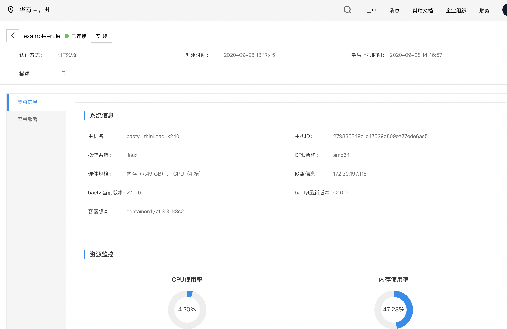
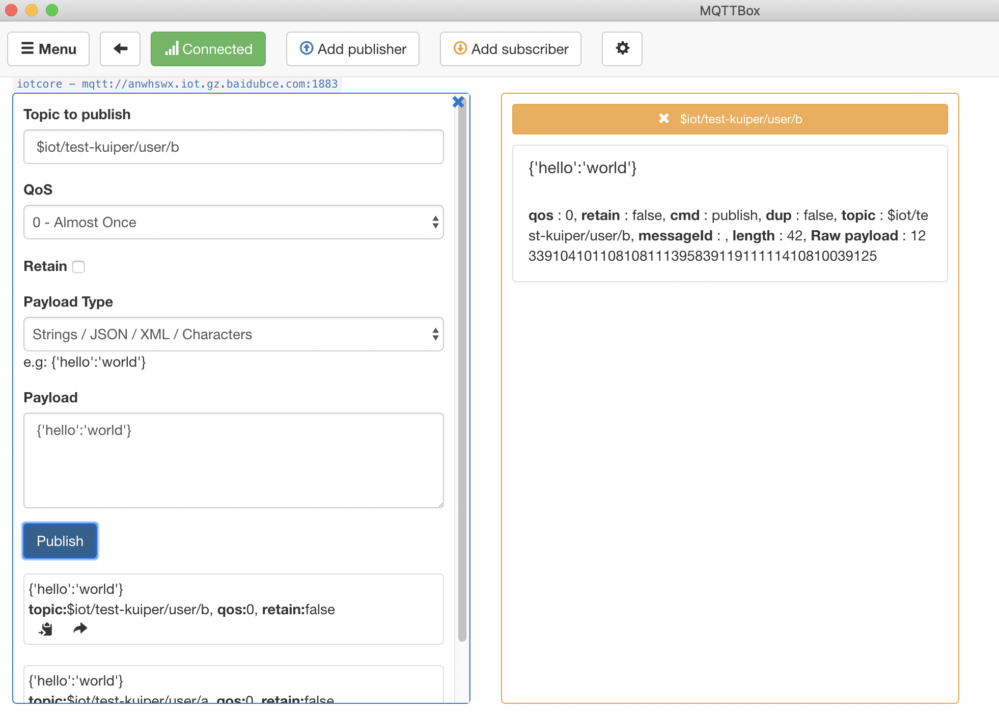
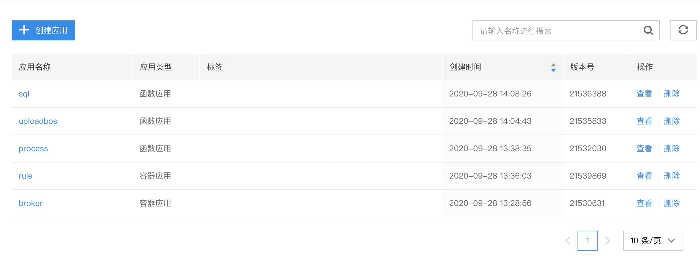
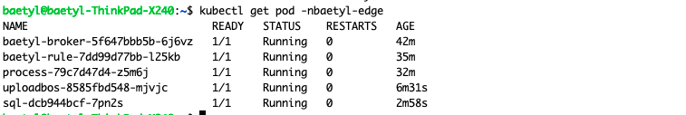
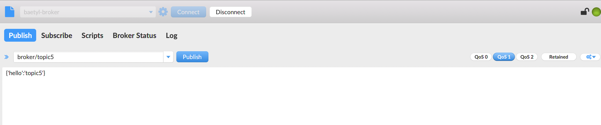

# 边缘规则引擎实践

规则引擎最先是在物联网云平台中应用开来。针对大量的物联网设备数据，规则引擎通过支持灵活的规则设置，对设备传上云端的设备时序数据、进行过滤、丰富、变换、动作、推送至不同的数据目的地（如时序数据库TSDB、Kafka、对象存储BOS等）以达到不同的业务目标。物联网规则引擎是基于事件驱动的数据流处理引擎，支持多种规则定义方式和描述方式。

在边缘计算场景下，要求边缘框架具有一定的自治能力，其中也包括对于端侧消息流具有一定的处理能力，可以实现消息的本地过滤、统计，再上传云端。边缘规则引擎可以实现端侧的消息路由能力，您可以设置边缘消息规则，控制本地消息在边缘计算节点中的流转，从而实现数据的安全可控。

## 名词解释
[Baetyl-Broker](https://github.com/baetyl/baetyl-broker): 单机版消息订阅和发布中心，采用 MQTT3.1.1 协议，是 Baetyl 框架端侧的消息中间件，为所有服务提供消息驱动的互联能力
Iot Core: 云端 mqtt broker，具体指一个具体的 endpoint, 可以使用域名以及用户凭证进行连接，收发 mqtt 消息
函数：Baetyl 框架的 Node、Python、Sql运行时，可以通过编写相应脚本进行消息的过滤、处理、转换以及丰富，可参考相关资料 [Baetyl-Function](https://github.com/baetyl/baetyl-function) 。

## 安装 Baetyl 计算框架

在云端新建边缘节点并安装到边缘设备。安装成功后如下所示：



## 新建 Iot Core 实例

参考 [百度云文档](https://cloud.baidu.com/doc/IoTCore/s/Akck4811r) 在 Iot Hub 新建 Iot Core 实例并进行相关的设备模板配置。配置成功后，使用 MqttBox 进行连接，其中 $iot/test-kuiper/user/# 主题是我们自定义的具有收发权限的用户主题。

相应的连接信息类似如下所示：
```
"mqtt":
  "server": "tcp://anwhswx.iot.gz.baidubce.com:1883",
  "topic": "$iot/test-kuiper/user/b",
  "protocol_version": "3.1.1",
  "username": "anwhswx/test-kuiper",
  "password": "xxxxxxxx"
```

我们可以通过 MqttBox 进行连接验证该 Iot Core 实例的连通性。




如上图可以观察到 Iot Core 实例的消息收发正常。

## 安装 Baetyl-Broker

新建容器应用 broker，并添加 baetyl-broker 服务，设置镜像以及端口。Baetyl-Broker 默认会监听 1883 端口，并允许匿名登录。


镜像地址
```
baetyltech/broker:v2.0.0
```

然后通过标签匹配到我们事先创建的节点上。


## 配置 Baetyl-Rule

数据的流转规则我们要配置在 baetyl-rule 模块中，所以这一步新建 baetyl-rule 相关的配置项。

先将边缘规则的场景进行分类和总结：

- 场景一：将边缘 broker 的某个 topic 消息送到 Iot Core 的某个 topic，对应如下配置文件 rule1
- 场景二：将边缘 broker 的某个 topic 消息送到 broker 的某个 topic，对应如下配置文件 rule2
- 场景三：将 Iot Core 的某个 topic 消息同步到 边缘 broker 的某个 topic，对应如下配置文件 rule3
- 场景四：消息过滤，比如订阅边缘 broker 的某个 topic，并在函数中对消息进行丰富和处理，然后再发送到 target topic，对应如下配置文件 rule4
- 场景五：消息过滤，比如订阅边缘 broker 的某个 topic，并在函数中对消息进行丰富和处理，但无下游 topic，对应如下配置文件 rule5

其中，为了演示，本文选取 nodejs 脚本模拟函数。python、sql 脚本也支持。

配置文件如下：
```
clients:
  - name: iotcore
    kind: mqtt
    address: 'tcp://anwhswx.iot.gz.baidubce.com:1883'
    username: anwhswx/test-kuiper
    password: xxx
rules:
  - name: rule1
    source:
      topic: broker/topic1
      qos: 1
    target:
      client: iotcore
      topic: $iot/test-kuiper/user/a
      qos: 1
  - name: rule2
    source:
      client: iotcore
      topic: $iot/test-kuiper/user/b
      qos: 1
    target:
      topic: broker/topic4
      qos: 1
  - name: rule3
    source:
      topic: broker/topic5
      qos: 1
    target:
      topic: broker/topic6
      qos: 1
    function:
      name: process
  - name: rule4
    source:
      topic: broker/topic7
      qos: 1
    function:
      name: uploadbos
  - name: rule5
    source:
      topic: broker/topic9
      qos: 1
    target:
      topic: broker/topic10
      qos: 1
    function:
      name: sql
```

然后创建配置项。


## 安装 Baetyl-Rule

新建容器应用 rule，并添加 baetyl-rule 服务，设置镜像并添加上一步中的相关配置项。


镜像地址：
```
baetyltech/rule:v2.0.0
```

然后通过标签匹配到我们事先创建的节点上。


## 安装 process 处理函数

一段 process 处理函数如下
```
exports.handler = (event, context, callback) => {
    callback(null, "Hello world!");
};
```

新建相关的配置项，注意添加运行时标签 nodejs10。


然后新建函数应用，并添加服务 process，引用该配置项，并通过标签匹配到我们事先创建的节点上。


然后通过标签匹配到我们事先创建的节点上。


## 安装 uploadbos 处理函数

一段上传 bos 的代码如下：
```
let bos = require('@baiducloud/sdk');
 
const config = {
    endpoint: <ENDPOINT>,
    credentials: {
        ak: <AK>,
        sk: <SK>
    }
};
 
let bucket = <BUCKET>;
let key = <KEY>;
let client = new bos.BosClient(config);
 
 
exports.handler = (event, context, callback) => {
    client.putObjectFromFile(bucket, key, <FILENAME>)
        .then(response => console.log(response))    // 成功
        .catch(error => console.error(error));      // 失败
 
    callback(null, "");
};
```

用于需要替换其中的 ENDPOINT， AK, SK, BUCKET, KEY, FILENAME 等字段需要用户替换成自己的。

本文替换相关参数如下：
```
let bos = require('@baiducloud/sdk');
 
const config = {
    endpoint: "http://bj.bcebos.com",
    credentials: {
        ak: "xxxxxx",
        sk: "xxxxxx"
    }
};
 
let bucket = 'test-bj-chen';
let key = 'ToUploadFile.txt';
let client = new bos.BosClient(config);
 
exports.handler = (event, context, callback) => {
    client.putObjectFromFile(bucket, key, "/temp/ToUploadFile.txt")
        .then(response => console.log(response))    // 成功
        .catch(error => console.error(error));      // 失败
 
    callback(null, "");
};
```

其中 ToUploadFile.txt 是待上传文件。

然后需要安装 @baiducloud/sdk 依赖

```
npm install @baiducloud/sdk
```

安装完成后目录结构如下


因为 node_modules 里包换多层级目录，不适合在配置项中直接配置，我们可以将所有文件打包，然后上传 bos，并在配置项这边选择"引入文件"。


然后在配置项引入，并选择解压。


创建待上传文件的配置项，注意添加运行时标签 nodejs10。


然后创建函数应用, 并添加服务 uploadbos，然后选择配置项 bosfile，将其绑定到 /temp 目录下，此目录约定见 js 代码。


然后该配置项在下发到端上后将会被解压开。

然后通过标签匹配到我们事先创建的节点上。


## 安装 sql 模块

首先创建 sql 配置项，注意添加运行时标签 sql。


其中 sql 语句是

```
select * where uid > 7
```

然后创建函数应用，并添加服务 sql。


然后通过标签匹配到我们事先创建的节点上。


如果上述步骤都操作正确的话，云端配置管理列表如下：


应用部署列表如下：



在节点中可以看到：


并可以看到此时的资源消耗：


在边缘侧执行下面命令可以看到：




## 场景一测试

向 broker 发送消息。


查看 iotcore 的 topic 是否收到消息。


可以观察到规则 rule1 已经生效。

## 场景二测试

向 Iot Core 发送消息


查看 broker 是否收到消息


可以观察到规则 rule2 已经生效。

## 场景三测试
向 broker broker/topic5 发送消息



查看 broker/topic6 是否收到消息


可以观察到 rule3 已经生效，消息也已经通过 process 函数进行处理。

## 场景四测试

向 broker broker/topic7 发送消息，然后查看 bos 的 bucket 文件是否上传。


可以观察到 文件已上传，rule4 已经生效

同时查看端上 uploadbos pod 日志：


表示上传成功。

## 场景五测试
向 broker/topic9 发送消息，其中 uid <7 ，然后订阅 broker/topic10 ，所以应该收不到消息


向 broker/topic9 发送消息，其中 uid > 7 ，然后订阅 broker/topic10 ，所以应该收到消息


