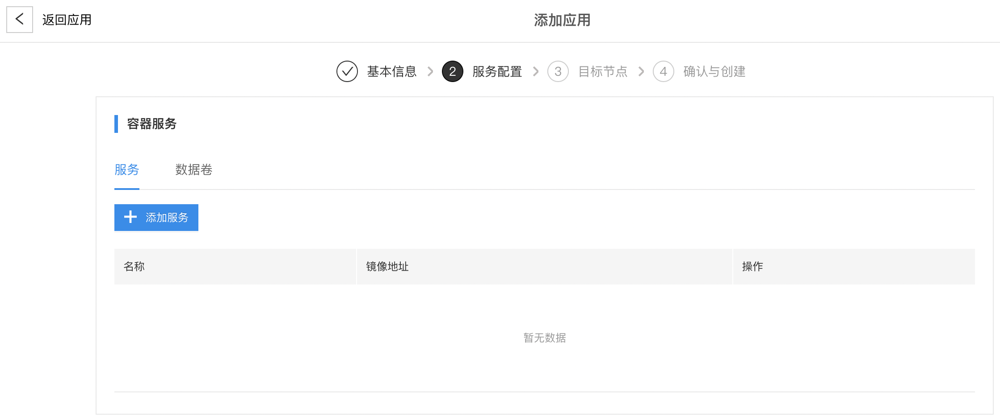
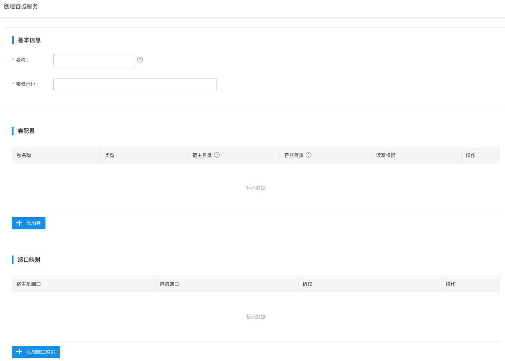

# 名词定义
容器应用：由服务配置和数据卷配置组成的应用。

函数应用：由函数定义和数据卷配置组成的应用。

# 功能简介
应用是用于定义在一个或一组边缘节点上的部署任务，会将**服务配置**及**存储卷配置**下发到匹配的目标设备上，并进行部署。应用根据边缘节点的标签来匹配目标设备，每一次应用信息的更改都会自动地下发到目标设备，并进行服务重部署及配置的更新。

应用分为容器应用和函数应用。

# 使用流程
创建应用流程有两种，分别为创建**容器应用**流程和创建**函数应用**流程。

## 应用列表
应用列表分页展示出当前实例下所有的应用信息。

在实例详情页的左侧菜单中点击**应用部署**，您将看到如下界面

右上角搜索框支持对应用名称进行模糊查询。

## 创建容器应用
### 基本信息
在**应用列表**页面点击**创建应用**进入应用创建页面。

填写应用**基本信息**

* 【名称】表示应用的名称，不可为空，不可重复
* 【应用类型】表示应用的类型，此处选择容器应用
* 【描述】表示应用的文字性描述
* 【标签】表示用来标识应用的信息

点击**添加标签**进入标签设置界面，填写应用标签。

### 服务配置
点击**下一步**进入服务配置界面。

点击**添加服务**进入服务配置页面

填写容器服务**基本信息**

* 【名称】表示服务的名称，不可为空。同一个应用中的服务名称不可重复，包含相同服务名称的不同应用部署到同一个节点会导致其中一个部署报错
* 【镜像地址】表示服务对应的镜像地址，不可为空。该地址应该填写在边缘节点（设备）上可以通过docker拉取的镜像地址
* 【标签】表示用来标识服务的信息
* 【卷配置】表示容器挂载的存储卷信息，支持hostPath、配置项和密文三种卷的挂载。 hostPath：挂载宿主机目录到容器目录；配置项：配置管理的配置信息；密文：配置管理里的密文信息。配置项创建在[这里](./Configuration-Management.md)， 密文创建在[这里](./Configuration-Management.md)

设置**容器服务**的标签，点击标签旁边**编辑图标**弹出添加标签界面

点击**添加卷**进行卷配置

点击**端口映射**进行端口映射配置

如果还需要更多配置，点击 **高级设置项** 进入配置设置

填写**高级设置项**

* 【副本数】表示服务启动的容器个数
* 【环境变量】表示服务容器的环境变量
* 【启动参数】表示启动时服务的参数
* 【资源限制】表示启动服务容器的资源限制，目前支持设置CPU和内存
* 【host网络】表示服务容器是否使用host网络，默认使用桥接网络
* 【特权选项】表示是否使用特权模式挂载资源，一般在摄像头，GPU或FPGA等需要较高权限访问的特殊资源时，设置为是

至此**服务配置**设置完成，点击**确定**关闭服务配置界面。

如需要设置镜像库凭证，点击**引入凭证**进入引入镜像库凭证界面

填写**镜像库凭证**

* 【镜像库凭证】表示拉取镜像时需要的凭证信息，一般用于需要凭证的镜像仓库配置， 镜像仓库凭证在[这里](./Configuration-Management.md)创建

### 目标设备
**服务配置**设置完成之后，点击**下一步**进入目标设备匹配界面

点击**匹配标签**，弹出标签匹配界面

输入想要匹配的节点标签名称及值，点击**确定**，会自动匹配出符合条件的节点

点击**创建**完成应用的创建，跳转到应用列表界面，就可以看到刚才创建的应用信息了

容器应用创建步骤到此全部完成。

## 创建函数应用
### 基本信息
在**应用列表**页面，点击**创建应用**进入应用创建页面。

填写应用**基本信息**

* 【名称】表示应用的名称，不可为空，不可重复
* 【应用类型】表示应用的类型，此处选择函数应用
* 【描述】表示应用的文字性描述
* 【标签】表示用来标识应用的信息

点击**添加标签**进入标签设置界面，填写应用标签。

### 函数服务
点击**下一步**进入函数服务界面

点击**添加服务**进入服务配置页面

填写函数服务**基本信息**

* 【名称】表示函数服务的名称，不可为空。同一个应用中的服务名称不可重复，包含相同服务名称的不同应用部署到同一个节点会导致其中一个部署报错
* 【函数配置项】表示选择配置管理里预先配置的函数，函数配置在[这里](./Configuration-Management.md)创建
* 【运行时】表示需要选择的函数运行时环境，目前运行时环境支持python3，nodejs10和sql
* 【函数列表】表示设置函数配置项里选择的函数的函数调用入口，支持多个函数调用

填写**高级设置项**

* 【副本数】表示服务启动的容器个数
* 【卷配置】表示配置函数存储的容器的目录
* 【资源限制】表示启动服务容器的资源限制，目前支持设置CPU和内存

至此**函数服务**设置完成，点击**确定**关闭服务配置界面。

### 目标设备
点击**下一步**进入目标设备匹配界面

点击**匹配标签**，弹出标签匹配界面

输入想要匹配的node标签名称及值，点击**确定**，会自动匹配出符合条件的节点

点击**创建**完成应用的创建，跳转到应用列表界面，就可以看到刚才创建的应用信息了

**函数应用**创建步骤到此全部完成。

## 应用修改
在**应用列表**页面，点击准备修改**应用名或查看**，例如function-test，进入**应用详情**页面

修改操作参考应用新建功能。

注意：应用修改后最新的应用配置会自动地下发到匹配的边缘节点，并进行更新。

## 应用删除
在应用列表页面，点击需要删除的应用后面的**删除**按钮

## 应用部署
应用创建后，需要了解应用在边缘节点部署情况。打开**应用详情**页面

点击**目标节点**里的**节点名**，跳转到**节点详情**页面，边缘节点创建在[这里](./Node-Management.md)

如果当前**边缘节点**没有在设备上安装，点击**安装**按钮，弹出在线安装命令

复制在线安装框里的命令，在设备上执行。注意：需要设备已经连接网络，设备能够访问我们的云端服务，设备端安装k8s或k3s。

安装如下：

期间可能需要输入用户密码。

安装完成后，可以看到应用已部署。

