# 配置管理

## 功能简介
配置是一种用于存储应用所需配置信息的资源类型，配置允许您将配置信息从应用容器镜像中解耦，从而增强应用的可移植性。配置资源可抽象成以下四类：
* 配置项
* 函数配置项
* 密文
* 镜像仓库凭证

## 配置项
配置项主要用于存储常规的配置信息，例如一组配置文件。应用将配置项以数据卷挂载的方式使用。例如，在“卷配置”中挂载配置项类型的卷，使其成为容器中的文件。对于配置项的任何更新，都会通过 Report/Desire 机制自动更新到正在使用它的容器里。配置项跟 Kubernets 中的 ConfigMap 概念类似，可参考 [Kubernetes文档](https://kubernetes.io/docs/concepts/configuration/configmap/) 。

配置价值如下：

* 使用配置功能可以帮您管理不同环境、不同业务的配置
* 方便您部署相同应用的不同环境，配置文件支持多版本，方便您进行更新和回滚应用
* 方便您快速将您的配置以文件的形式导入到容器中

目前配置项分为普通配置项和函数配置项。函数配置项用于存储函数应用需要加载的程序脚本，支持 Python36、Nodejs10、Sql 等运行时。函数配置项通过添加函数标签来进行标识。添加函数标签后，可以在创建函数应用时选择使用。
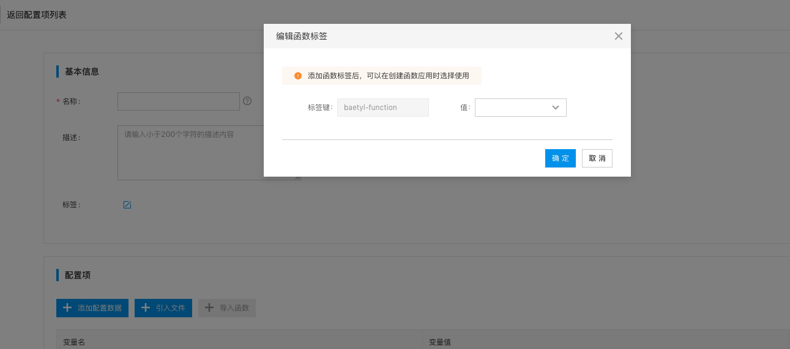

### 创建配置项
1. 选择左侧导航栏 "配置管理 > 配置项 > 创建配置项"；

    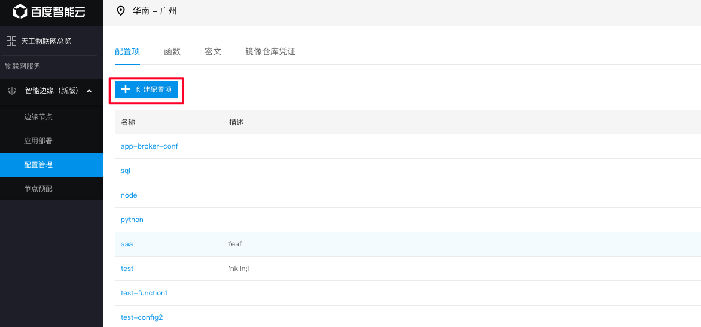

2. 填写配置项信息
    * 名称：配置项名称，不可为空，不可重复
    * 描述：配置项描述信息，可为空
    * 配置项数据: 配置项数据是键值对形式，请输入属性名和属性值。可为空
    * 运行时：目前支持 Python36、Nodejs10、Sql 运行时，可为空

    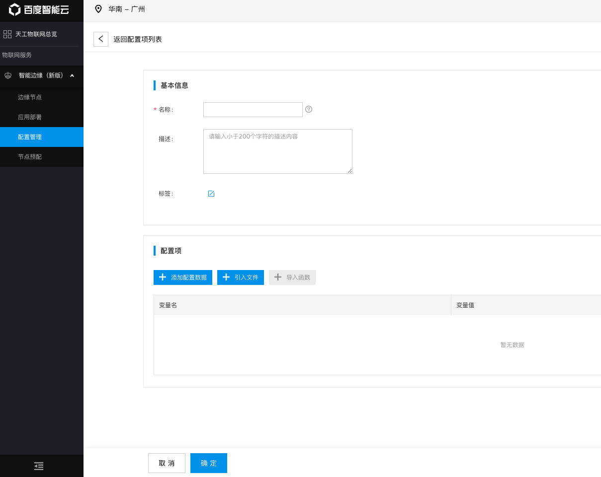
   
配置项挂载到应用中的服务里后，在服务对应的容器中会根据配置项的内容在挂载目录下创建文件，每条配置数据（属性名-属性值）为一个文件，其中属性名即文件的名称，属性值为文件的内容。例如某条数据的属性名为 “key”，属性值为 “value”，挂载到 /test 目录下。如果挂载成功后，在 /test 目录下就存在一个名为 “key” 的文件，其内容为 “value”。

配置项数据支持两种添加方式。

#### 添加配置数据
手动添加配置数据。变量名为文件名，变量值为文件内容。

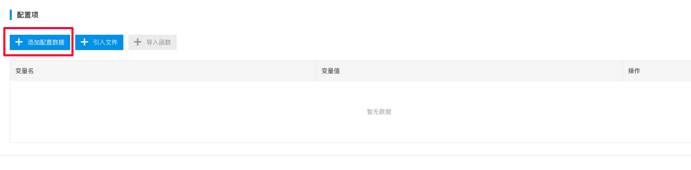

#### 引入文件
从对象存储引入文件，通常为大容量文件。支持的对象存储类型有 "百度云对象存储服务(BOS)" 或者符合 AWSS3 接口的对象存储，例如 Minio，CEPH。

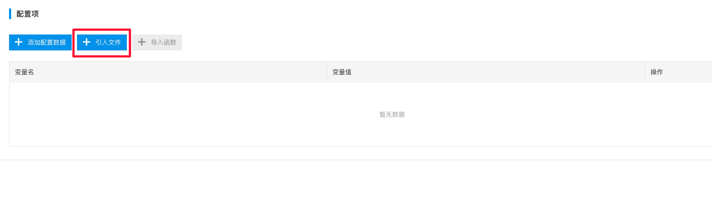

对于使用百度云 BOS 服务的用户，可以事先将需要引入的压缩包上传至 BOS，且需要位于同一个区域。然后选择对象存储类型为 "BOS"、bucket 名称、文件名称以及是否解压，并点击 "确定"。如果选择了 "解压"，该压缩包下发端侧时会进行解压操作。用户需要自行保证解压后的文件与其他配置项数据的冲突问题。


对于外部的对象存储，可以支持符合 AWSS3 接口的对象存储，例如 Minio，CEPH。用户需要填写 endpoint、bucket名称、文件名称、是否解压等选项。如果用户不填写 AK/SK，则认为用户提供的文件具有 "公共读" 权限，并且在下发端上的时候不会进行 MD5 文件校验。


> 为了保证文件在下载后的数据完整性，我们采用了 MD5 校验。在引入文件的时候支持填写 MD5 值，端侧设备在下载后将会计算文件的 MD5 值，然后与云端的 MD5 值进行比对，确保数据完整性。

### 查找配置项
选择左侧导航栏 "配置管理 > 配置项 > 搜索栏"；

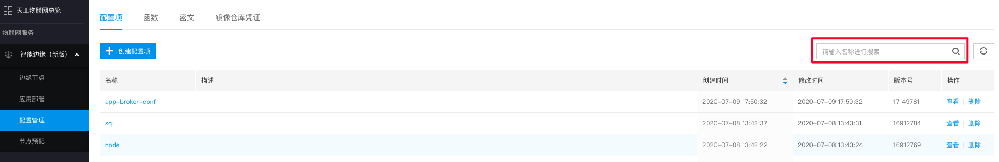

### 删除配置项
选择左侧导航栏 "配置管理 > 配置项 > 删除"；

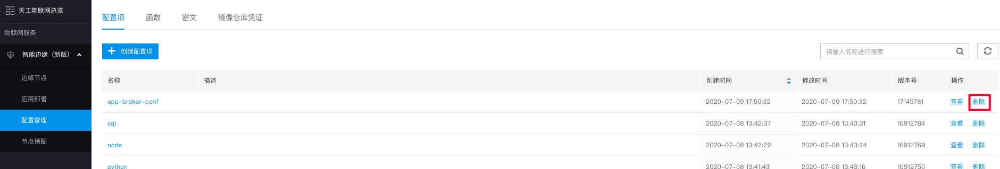

## 函数配置项
函数配置项是配置项的子集，默认添加了函数标签。用于存储函数应用需要加载的程序脚本，支持 Python36、Nodejs10、Sql 等运行时。添加函数标签后，可以在创建函数应用时选择该配置项使用。

### 创建函数配置项
1. 选择左侧导航栏 "配置管理 > 函数 > 创建函数"；

    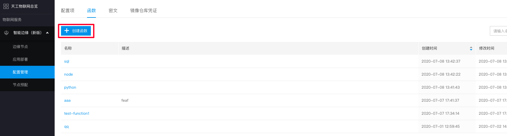

2. 填写配置项信息
    * 名称：配置项名称，不可为空，不可重复
    * 描述：配置项描述信息，可为空
    * 配置项数据: 配置项数据是键值对形式，请输入属性名和属性值。可为空
    * 运行时：目前支持 Python36、Nodejs10、Sql 运行时，可为空

    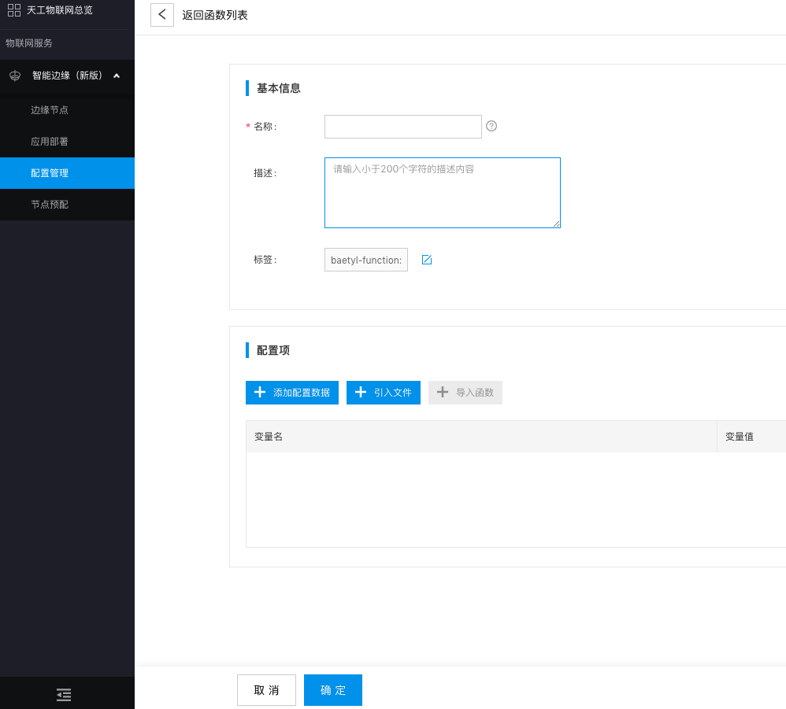

#### 添加函数脚本
我们在本地调试好函数脚本后，可以添加到配置项数据中。
* 对于 Python36 运行时的函数配置项，我们可以添加一段 Python 脚本。
```python
#!/usr/bin/env python3
# -*- coding: utf-8 -*-

def handler(event, context):
  return "Hello world!"
```

* 对于 Nodejs10 运行时的函数配置项，我们可以添加一段 js 脚本。
```javascript
#!/usr/bin/env node

exports.handler = (event, context, callback) => {
  callback(null, "Hello world");
};
```

* 对于 Sql 运行时的函数配置项，我们可以添加一段 sql 脚本。
```sql
select name as result where uid > 6
```

### 查找函数配置项
选择左侧导航栏 "配置管理 > 函数 > 搜索栏"；

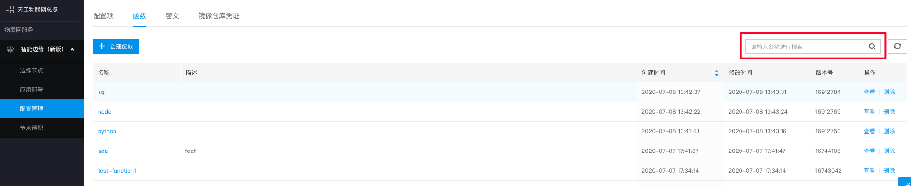

### 删除函数配置项
选择左侧导航栏 "配置管理 > 函数 > 删除"；

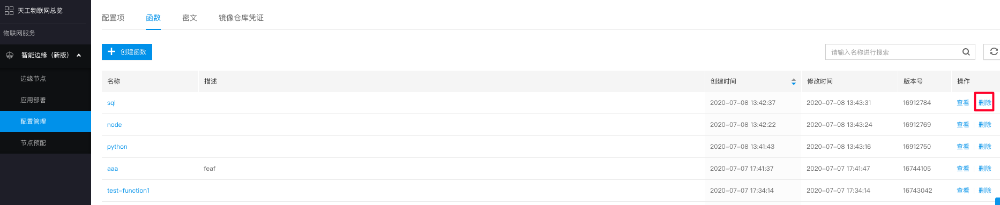

## 密文
密文用于存储敏感数据，例如密码，令牌或密钥。它们可能包含一个或多个键值对。与添加配置项一样，应用服务将密文以数据卷挂载的方式使用。例如，在“卷配置”中挂载密文类型的卷，使其成为容器中的文件。对于密文的任何更新，都会自动更新到使用他的容器中。密文跟 Kubernets 中的 Secret 概念类似，可参考 [Kubernetes文档](https://kubernetes.io/docs/concepts/configuration/secret/) 。

### 创建密文
1. 选择左侧导航栏 "配置管理 > 密文 > 创建密文"；

    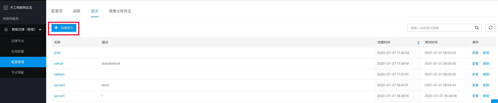

2. 填写密文信息
    * 名称：密文名称，不可为空，不可重复
    * 描述：密文描述信息，可为空
    * 密文数据: 密文数据是键值对形式，请输入属性名和属性值。可为空

    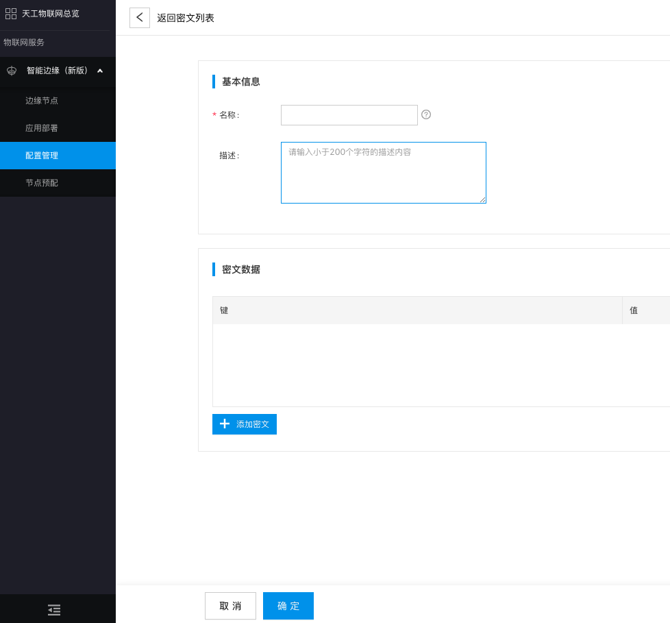

### 查找密文
选择左侧导航栏 "配置管理 > 密文 > 搜索栏"；

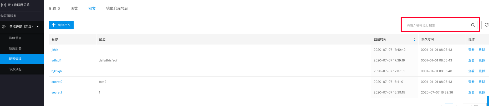

### 删除密文
选择左侧导航栏 "配置管理 > 密文 > 删除"；

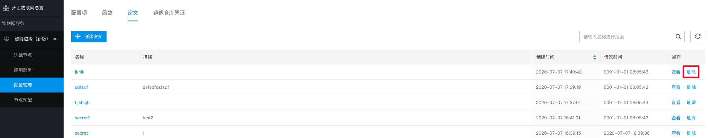


## 仓库镜像凭证
镜像库凭证是用于向私有 Docker 镜像库进行身份验证的凭据。资源创建完成后，可在添加应用时选择 "镜像库凭证" 引入凭证。 镜像库凭证本质上也是一个 Kubernets Secret，可参考 [Kubernetes文档](https://kubernetes.io/docs/tasks/configure-pod-container/pull-image-private-registry/) 。

### 创建凭证
1. 选择左侧导航栏 "配置管理 > 镜像仓库凭证 > 创建凭证"；

    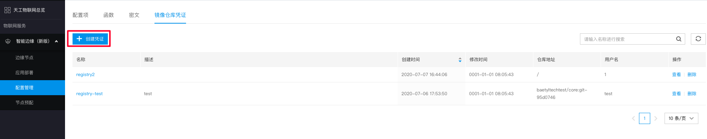

2. 填写凭证信息。
    * 名称：凭证名称，不可为空，不可重复
    * 描述：凭证描述信息，可以为空
    * 凭证数据: 私有 Docker 镜像库登录信息，分别为镜像地址、用户名、密码

    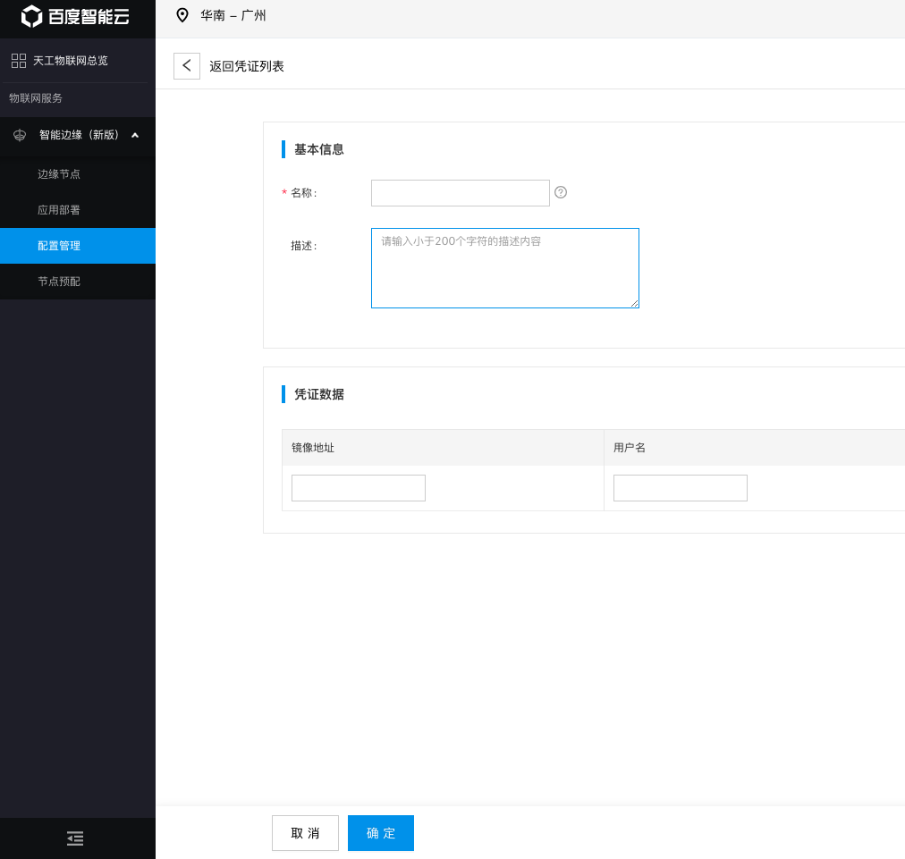

### 查找凭证
选择左侧导航栏 "配置管理 > 镜像仓库凭证 > 搜索栏"。

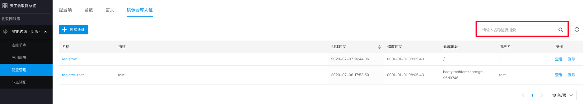

### 重设密码
对于已创建的凭证，可以重设凭证数据中的密码。更新后的密码都会通过 Report/Desire 机制自动更新到正在使用它的容器里。

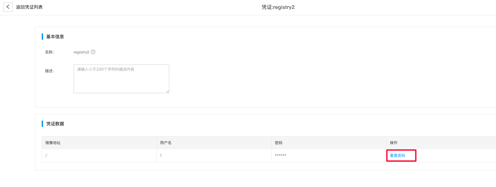

### 删除凭证
选择左侧导航栏 "配置管理 > 镜像仓库凭证 > 删除"；

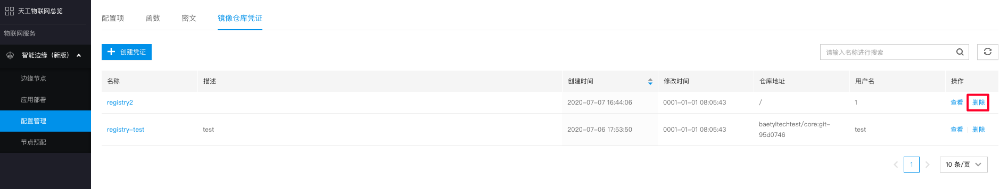


