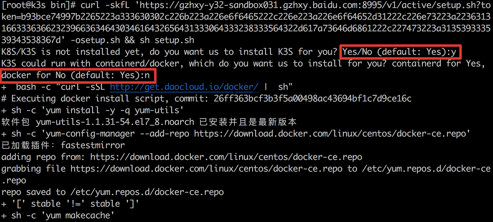
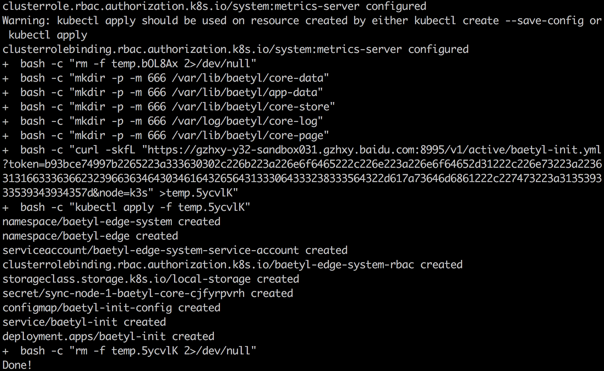

  
# 功能简介
节点是边缘设备在云端的映射，云端一个节点代表一个边缘设备。通过在云端创建节点，在边缘设备完成节点安装后，就可以对边缘设备进行管理。此外，还可以在云端查看已有的节点，编辑节点的信息，删除节点。

# 使用说明
对节点的操作包括创建节点，删除节点，对节点编辑，以及安装节点。

## 创建节点
左侧菜单栏点击边缘节点，进入边缘节点页面并点击 **创建节点**，进入节点创建页面

* 名称: 节点名称，不可为空，不可重复
* 描述：描述可以为空
* 标签：对节点进行标识，用于关联应用，可以不绑定标签，也可以绑定多个标签
* 认证方式: 节点端云同步使用证书（强制）

点击确定完成节点创建后可以在节点列表看到已创建节点。

## 删除节点
在节点列表页面点击删除，弹出确定窗口

点击确定后完成节点删除。

## 节点编辑

点击节点进入节点详情页可对节点描述信息和标签进行编辑，可以添加新的标签，修改已有标签键值，或删除已有标签。

## 节点安装
节点安装现仅支持在线安装。baetyl运行模式包括 **k3s+docker** 和 **k3s+containerd** 两种，在设备安装后，会检查设备上是否有docker, k3s环境，由用户选择确认进行安装。默认仅安装k3s，使用 **k3s+containerd** 模式。如使用 **k3s+docker** 模式，则需要选择安装docker后再安装k3s。设备上已有上述环境时不会再安装。

**k3s+containerd模式**

在节点详情页点击安装弹出窗口，复制安装命令，在设备上执行命令，当选择是否安装k3s时输入 y，选择containerd（Yes）和 docker (No)时输入 y

**k3s+docker模式**

在节点详情页点击安装弹出窗口，复制安装命令，在设备上执行命令，当选择是否安装k3s时输入 y，选择containerd（Yes）和 docker (No)时输入 n

采用上述两种模式安装都会在 **baetyl-edge-system** 部署 **baetyl-core** 和 **baetyl-function** 两个服务。查看 **baetyl-edge-system** 命名空间下的pod均处于运行状态即表示节点安装完成。

## 查看节点
在节点详情页可以看到节点已连接，显示了节点的详细信息与资源使用情况。

点击左边栏应用部署菜单可以查看已部署的应用相关信息和资源使用情况。

