# 节点预配

## 功能简介
节点预配主要面向边缘设备批量注册激活的场景。您可以通过创建产品批次，然后在此产品下通过多种方式注册和激活一批边缘节点。同一产品批次的激活的节点具有相同的标签，方便您后续对这些节点进行操作管理

## 设计说明
在实际的边缘部署场景中，我们经常会有批量对设备进行注册、激活和管理的需求。节点预配功能即提供了产品批次的创建和管理、设备注册的管理及生成初始化部署命令的能力

主要操作步骤如下：
1. 创建产品批次
2. 注册和管理设备指纹
3. 在设备端部署安装
4. 在云端查看激活状态和激活节点详情

## 使用流程
在智能边缘左侧菜单中点击节点预配，您将看到如下界面

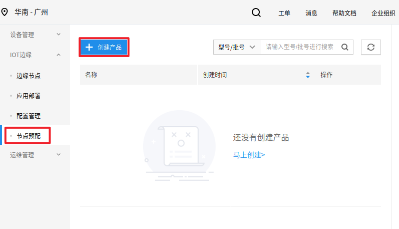

点击创建产品按钮进入产品的创建界面

* 【名称】表示创建的产品的名字
* 【白名单】表示是否要开启白名单功能，即是否需要进行设备指纹的预注册。在白名单开关打开的情况下，您需要在后续的产品详情页预先录入要激活设备的设备指纹，当设备尝试激活时，会对激活设备提供的指纹进行对比，判断是否在预注册列表中，只有在列表中的设备才能激活；在白名单开关关闭的情况下，您无需在产品详情页预录入设备指纹，当设备尝试激活时，云端会自动把设备提交的设备指纹注册进列表并激活创建对应节点
* 【激活方式】表示设备端激活通过何种方式采集设备指纹提交进行激活。目前支持的模式有：SN文件、手动输入、系统Hostname、系统BootID、系统SystemUUID、系统MachineID。当选择SN文件时，会需要您指定【SN文件路径及名称】，默认路径为：/var/lib/baetyl/sn/fingerprint.txt。当选择手动时，会需要您指定Web页面采集【字段名称】，默认为sn。当选择其他方式时，系统会自动从设备中收集相关信息，无需您额外配置。
* 【描述】表示对此产品的文字性描述

因为产品的创建和激活有多种选项组合，后面会分别以【未开启白名单通过文件激活的方式】和【开启白名单通过手动激活的方式】进行流程介绍

### 未开启白名单通过文件激活的方式
点击【创建产品】按钮

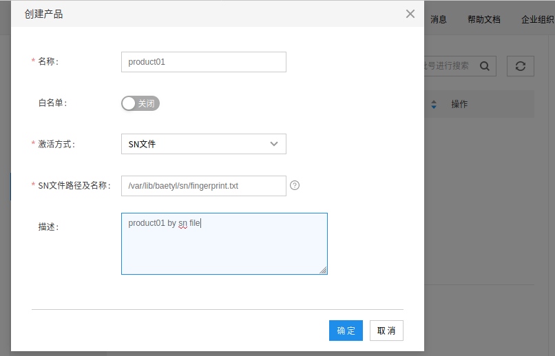

选择关闭【白名单】，选取SN文件作为【激活方式】，采用默认的【SN文件路径及名称】或自己指定SN文件存放位置(**[注意]** Mac系统下SN文件必须放在用户目录下，而不能放在系统目录下)。点击确定创建产品

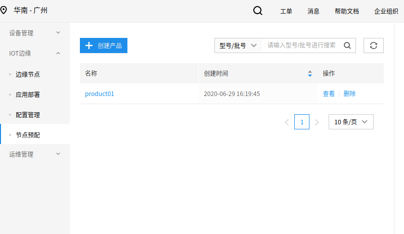

点击产品名称或【查看】可以进入产品详情页，点击【删除】可以删除没有注册记录的产品。此处点击【查看】进入如下页面

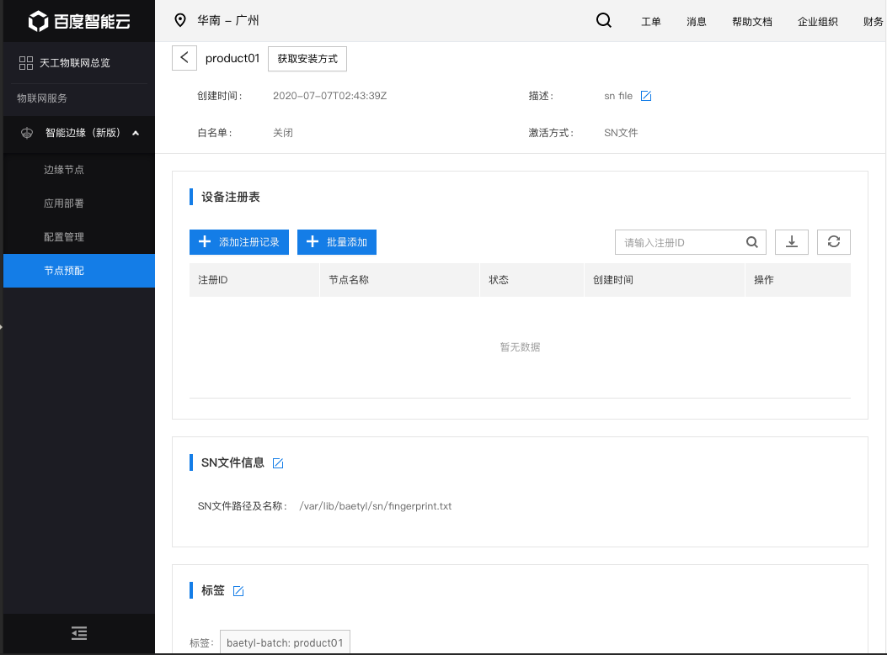

点击【获取安装方式】并复制在线安装命令

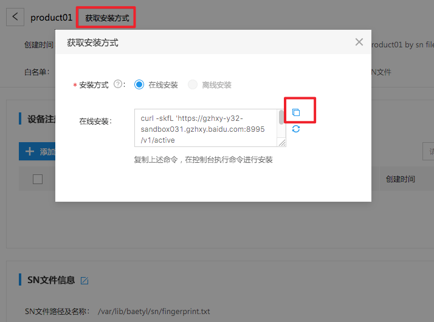

在边缘测设备上【SN文件路径及名称】路径下预先烧录好记录设备指纹的文件，如图所示

在设备的终端上执行之前复制的在线安装命令，会显示类似安装过程

其中如果设备上没有运行所需的k3s环境，安装命令运行期间会询问是否要安装k3s，按需求选择即可

待命令安装完成后，可以通过kubectl命令查看部署状态

如果设备正常激活，则最终会看到系统模块【baetyl-core】【baetyl-function】模块启动运行

此时可以在云端产品详情页看到设备注册激活的情况

在【边缘节点】列表中也可以找到对应节点

可以点击查看节点详情

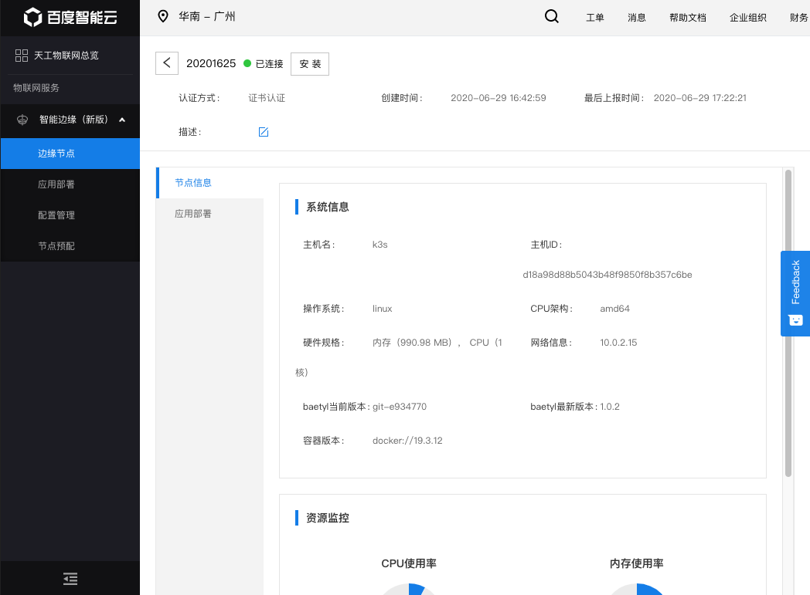

可以看到节点已经正常注册激活并开始了进行信息上报，至此注册激活完成

2）开启白名单通过手动激活的方式
点击【创建产品】按钮

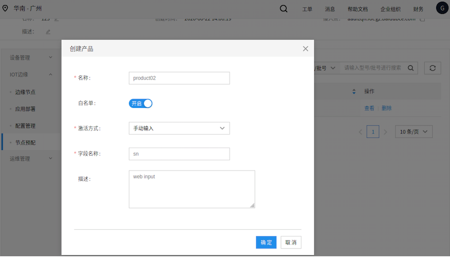

选择开启【白名单】，选取手动输入作为【激活方式】，采用默认的【字段名称】。点击确定创建产品

点击产品名称或【查看】可以进入产品详情页

因为此产品开启了白名单验证，所以我们需要先添加设备指纹注册记录。这里提供单条添加和系统批量添加的方式，下面逐一进行介绍

a.单条手动添加

点击【添加注册记录】，可以选择注册ID由系统生成的方式进行添加，此时可以选择指定节点名称，若不指定则后续会使用注册ID作为节点名称

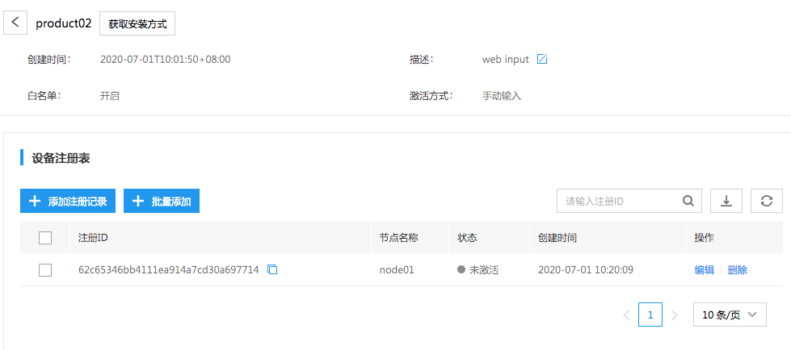

也可以选择手动录入作为注册ID的设备指纹，如图所示

b.批量添加

点击【批量添加】按钮，即可由系统添加指定条注册记录

可以在激活前通过点击注册记录右侧的【编辑】按钮来修改节点名称

可以在激活前通过点击注册记录右侧的【删除】按钮来删除注册记录

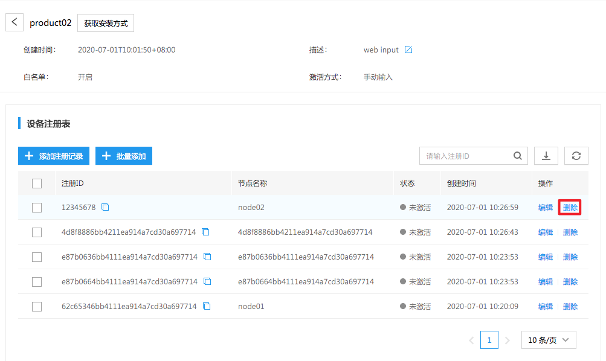

添加完注册记录了以后就可以通过点击产品名称右侧的【获取安装方式】按钮来获取在线安装命令

在设备的终端上执行之前复制的在线安装命令，会显示类似安装过程

安装后可以通过kubectl get pod -n baetyl-edge-system命令查看模块运行情况

因为本次采用的是【手动输入】的激活方式，所以需要在浏览器访问：http://127.0.0.1:30007 页面来进行激活

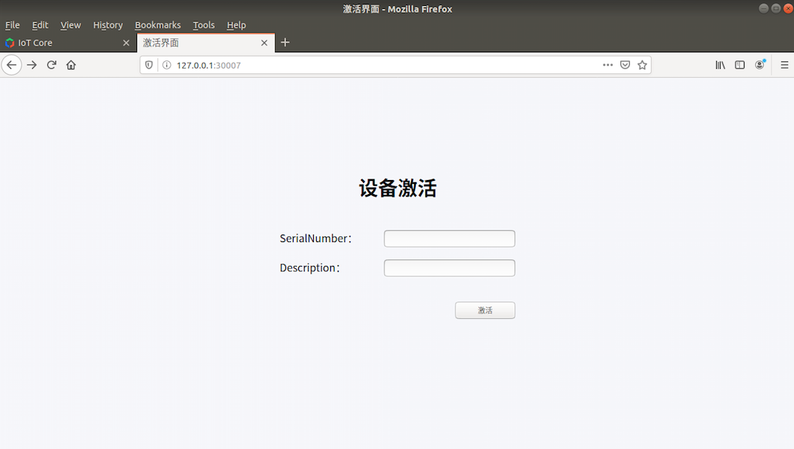

<<<<<<< HEAD
=======
**[注意]** Mac系统宿主机端口无法正常工作，浏览器无法打开

>>>>>>> cc74c27... update
在【SerialNumber】对应的输入框输入注册的设备指纹，在【Description】对应的框中可以选择性的输入描述信息，然后点击【激活】即可

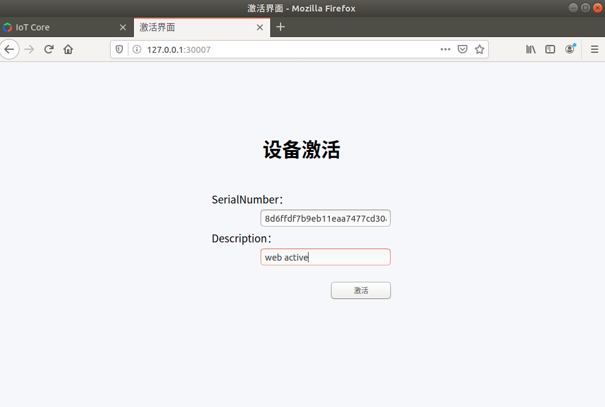

显示“激活成功”则表示已经激活完毕，可以通过如下命令，查看模块部署启动情况

最终可以看到baetyl-core模块和baetyl-function模块正常运行

在云端可以查看激活情况

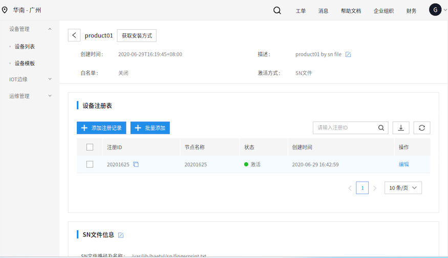

点击蓝色的节点名称或者在边缘节点页面可以查看节点详情

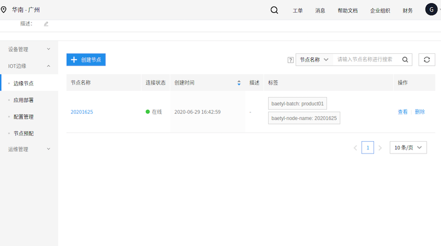

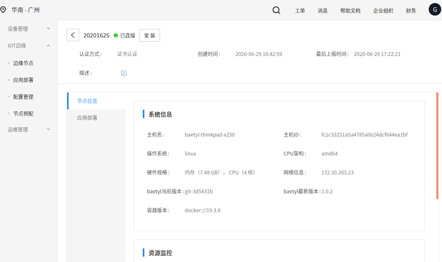

至此在开启白名单的情况下节点注册激活完毕

3）其他激活方式说明
在【创建产品】的弹窗页面，您还可以选择系统Hostname、系统BootID、系统SystemUUID、系统MachineID的作为设备指纹获取方式

其中，系统Hostname可以在边缘设备上通过如下方式查看

这里master角色下的的node的NAME即为激活时采集的hostname

其中，系统BootID、系统SystemUUID、系统MachineID的可以通过如下方式进行查看

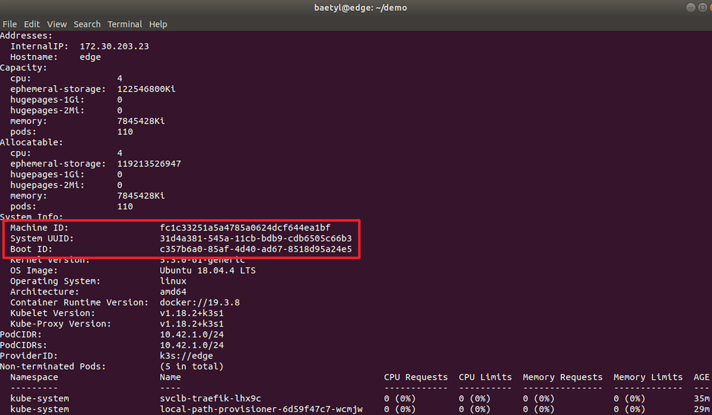

当在边缘设备执行在线安装命令后，模块即会自动采集对应信息进行激活
